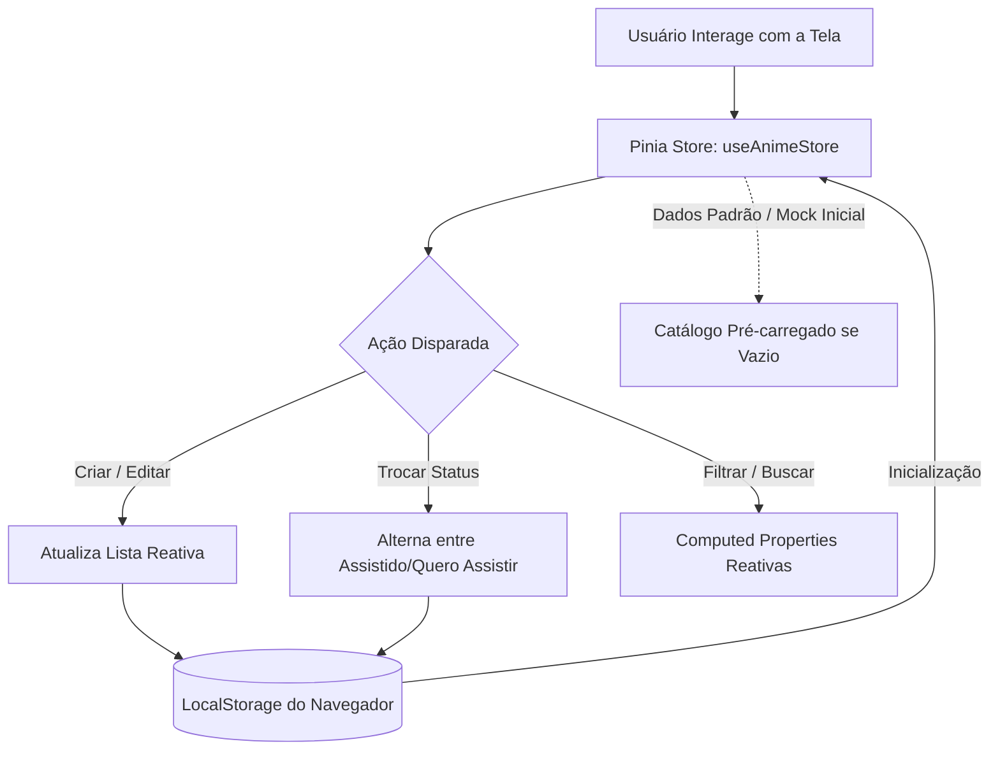
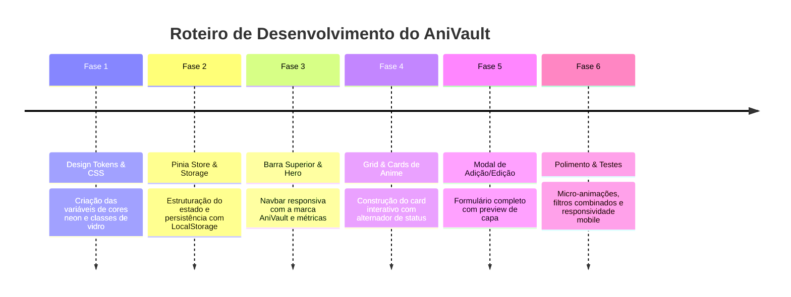

# 🎌 Plano Diretor de Criação & Design System: **AniVault (アニ記録)**
> **Plataforma Client-Side para Registro e Curadoria Pessoal de Animes**  
> *Documento de Especificação Técnica, Arquitetura de Componentes e Identidade de Marca*

---

## 📑 Sumário Executivo
Este documento estabelece o plano completo para o desenvolvimento de uma interface moderna e imersiva para acompanhamento de animes (*Anime Tracker*). A aplicação é **100% frontend** (dispensando infraestrutura de backend), utilizando persistência local via `localStorage`, gerenciamento reativo de estado e uma experiência visual inspirada nas melhores plataformas de streaming e entretenimento digital moderno.

---

## 1. 🌌 Criação da Marca & Identidade Visual

### 1.1 Nome e Posicionamento
* **Nome da Marca:** **AniVault** (com o kanji decorativo oficial **アニ記録** - *AniKiroku* / Registro de Animes).
* **Slogan Oficial:** *"Sua jornada otaku, eternizada no seu universo."*
* **Personalidade:** Tecnológica, vibrante, elegante, focada na paixão pelos animes e na sensação de conquista do usuário à medida que completa episódios e séries.

### 1.2 Conceito do Logo
* **Símbolo:** Uma insígnia poligonal que une o contorno estilizado de um portal dimensional (*Vault*) com duas orelhas sutis de raposa kitsune em néon, revelando um botão de "Play" central.
* **Tipografia do Logo:** `Outfit` ou `Cabinet Grotesk` com tracking aumentado (`tracking-wider`), caixa alta e acento de cor:
  $$\mathbf{\text{ANI}}\color{#00F5D4}{\text{VAULT}} \quad \color{#8A2BE2}{\text{「アニ記録」}}$$

### 1.3 Paleta de Cores e Tokens de Design (Dark Cyberpunk / Glassmorphism)

| Token / Variável | Cor Hexadecimal | Amostra & Significado | Uso Principal |
| :--- | :--- | :--- | :--- |
| `--bg-base` | `#08090E` | 🌑 Preto Espacial Profundo | Fundo geral da aplicação |
| `--bg-surface` | `rgba(16, 20, 34, 0.75)` | 🌌 Vidro Acrílico com Blur | Cards, modais e barras flutuantes |
| `--color-primary` | `#7C3AED` | 🟣 Roxo Neon / Cyber Violet | Ações primárias, foco, gradientes |
| `--color-accent` | `#00F5D4` | 🟢 Ciano Elétrico | Destaques pontuais, badges ativos, brilhos |
| `--color-warning` | `#F59E0B` | ⭐ Âmbar Dourado | Classificação por estrelas e favoritos |
| `--status-watching` | `#06B6D4` | 🔵 Azul Ciano Turquesa | Status: **Assistindo** (Em andamento) |
| `--status-completed`| `#10B981` | 🟢 Verde Esmeralda | Status: **Assistido** (Concluído) |
| `--status-planned`  | `#A855F7` | 🟣 Púrpura Orquídea | Status: **Quero Assistir** (Fila) |
| `--text-primary`    | `#F8FAFC` | ⚪ Branco Cristalino | Títulos e textos de alto contraste |
| `--text-muted`      | `#94A3B8` | 🔘 Cinza Ardósia | Metadados, contadores e legendas |

### 1.4 Estilo e Tratamento Visual (Visual Polish)
* **Glassmorphism:** Efeito de desfoque de fundo (`backdrop-filter: blur(14px)`), com bordas translúcidas finas (`border: 1px solid rgba(255, 255, 255, 0.08)`).
* **Glow & Elevation:** Efeitos de sombra luminosa ao passar o mouse (`box-shadow: 0 12px 30px -8px rgba(124, 58, 237, 0.35)`).
* **Micro-interações:**
  * Zoom suave da imagem do pôster no hover (`transform: scale(1.05)`).
  * Feedback tátil com transição fluida nas mudanças de status.
  * Barra de progresso neon de episódios visualizados.

---

## 2. 🏗️ Arquitetura Funcional (Client-Side & Sem Backend)

Como não haverá linguagem de backend, todo o ciclo de vida dos dados será gerenciado localmente no navegador do usuário:



### 2.1 Modelo de Dados (TypeScript Interface)

```typescript
export type AnimeStatus = 'assistindo' | 'assistido' | 'quero_assistir' | 'pausado';

export interface Anime {
  id: string;                      // UUID ou timestamp
  titulo: string;                  // Nome principal (ex: "Jujutsu Kaisen")
  tituloOriginal?: string;         // Nome em Japonês/Romaji (ex: "呪術廻戦")
  capaUrl: string;                 // URL da imagem do pôster
  status: AnimeStatus;             // Status atual
  episodiosVistos: number;         // Contador de episódios assistidos
  totalEpisodios: number | null;   // Total (null para animes em exibição contínua)
  nota: number;                    // Avaliação pessoal (0 a 10 ou 1 a 5 estrelas)
  favorito: boolean;               // Marcador de destaque / favorito
  generos: string[];               // Categorias (ex: ["Ação", "Fantasia", "Shounen"])
  anoLancamento?: number;          // Ano de exibição
  comentario?: string;             // Anotações ou review pessoal
  criadoEm: string;                // Data ISO de adição à lista
}
```

### 2.2 Estratégia de Mock Inicial
Para que a primeira impressão do usuário seja deslumbrante e ele não veja uma tela vazia sem vida, o sistema carregará automaticamente uma lista com 6 a 8 animes populares e aclamados (ex: *Frieren: Beyond Journey's End*, *Fullmetal Alchemist: Brotherhood*, *Attack on Titan*, *Demon Slayer*, *Solo Leveling*, *Spirited Away*), já com pôsteres em alta definição e status pré-definidos para teste imediato.

---

## 3. 🧩 Especificação dos Componentes da Tela

A interface será construída como uma SPA (Single Page Application) modularizada em componentes Vue 3 com `<script setup lang="ts">` e Bootstrap 5 Icons:

```
src/
├── components/
│   ├── anime/
│   │   ├── TheNavbar.vue          # Topbar fixa com logo AniVault, busca e botão Adicionar
│   │   ├── HeroStats.vue          # Banner de boas-vindas com contadores rápidos
│   │   ├── FilterBar.vue          # Abas de status (Todos, Assistindo, Assistidos, etc.)
│   │   ├── AnimeCard.vue          # Card de exibição do anime com ações rápidas
│   │   ├── AnimeGrid.vue          # Grid responsivo e estados de animação
│   │   ├── AnimeModalForm.vue     # Modal para cadastrar / editar animes
│   │   ├── AnimeDetailDrawer.vue  # Gaveta/modal com sinopse e anotações pessoais
│   │   └── EmptyState.vue         # Ilustração quando nenhum anime for encontrado
│   └── ui/
│       ├── StarRating.vue         # Componente interativo de estrelas
│       └── ProgressBar.vue        # Barra de progresso com gradiente neon
└── stores/
    └── animeStore.ts              # Gerenciador de estado Pinia com sincronização LocalStorage
```

### 3.1 Detalhamento de Cada Componente

#### A. `TheNavbar.vue` (Barra Superior & Marca)
* **Elementos:**
  * **Logo AniVault:** Símbolo com gradiente e tipografia personalizada.
  * **Busca Global em Tempo Real:** Campo de texto com debounce para filtrar animes por título instantaneamente.
  * **Botão de Ação Rápida:** Botão "+ Adicionar Anime" destacado com gradiente roxo-ciano e sombra luminosa.
  * **Backup / Restauração:** Dropdown discreto para exportar ou importar a lista de animes em formato `.json`.

#### B. `HeroStats.vue` (Resumo Estatístico do Usuário)
* **Objetivo:** Estimular o engajamento visual com métricas em estilo "Gamificação".
* **Cards de Métricas:**
  * 🟢 **Assistidos:** Total de animes concluídos.
  * 🔵 **Assistindo:** Animes que estão em progresso.
  * 🟣 **Quero Assistir:** Animes na fila de espera.
  * ⭐ **Favoritos:** Animes marcados com estrela.
  * 🎬 **Episódios:** Total geral de episódios consumidos.

#### C. `FilterBar.vue` (Barra de Filtros e Ordenação)
* **Pills de Status:**
  * `[ Todos ]`
  * `[ Assistindo (N) ]`
  * `[ Assistido (N) ]`
  * `[ Quero Assistir (N) ]`
  * `[ ★ Favoritos ]`
* **Controles Complementares:**
  * Seletor de Gênero (dropdown com tags).
  * Ordenação: *Maior Nota*, *Mais Recentes*, *Nome (A-Z)*.
  * Alternador de visualização: Grade de Pôsteres (*Poster Grid*) vs. Tabela Compacta (*List View*).

#### D. `AnimeCard.vue` (O Coração da Interface)
* **Proporção Visual:** Pôster 2:3 ou 3:4 com cantos arredondados (`rounded-4`).
* **Camada de Sobreposição (Overlay no Hover):**
  * Botão de Favoritar (coração que pulsa ao clicar).
  * Botão de Aumento Rápido de Episódios: Um botão flutuante `+1 Ep` para que o usuário avance o episódio assistido sem precisar abrir um formulário!
  * Botão de Edição e Exclusão.
* **Rodapé do Card:**
  * Título do Anime em negrito com `text-truncate`.
  * **Badge Seletor de Status:** Um menu suspenso ou chip clicável que permite alternar entre **Assistido**, **Assistindo** ou **Quero Assistir** com apenas 1 clique.
  * Barra de progresso visual mostrando a porcentagem de episódios vistos (ex: `12 / 24 ep - 50%`).
  * Estrelas de avaliação pessoal.

#### E. `AnimeModalForm.vue` (Cadastro e Edição)
* **Campos do Formulário:**
  1. **Título do Anime** (Obrigatório).
  2. **URL da Imagem / Pôster** (Com pré-visualização instantânea da capa).
  3. **Status Inicial** (Dropdown: *Assistindo*, *Assistido*, *Quero Assistir*).
  4. **Progresso de Episódios:** Campos lado a lado: *Episódios Vistos* e *Total de Episódios*.
  5. **Nota Pessoal:** Seletor interativo de 1 a 10 ou 5 estrelas.
  6. **Gêneros:** Tags selecionáveis (Ação, Aventura, Ficção, Romance, Fantasia, etc.).
  7. **Comentário / Review Pessoal:** Campo de texto livre para impressões sobre a obra.

#### F. `EmptyState.vue` (Estado Vazio Encantador)
* Exibido quando a busca não retorna resultados ou quando uma categoria está sem animes.
* Mensagem acolhedora com ícone estilizado e botão direto para "Explorar ou Cadastrar Anime".

---

## 4. 🎨 Wireframe Estrutural da Interface

```
+-----------------------------------------------------------------------------------+
|  [ 🦊 ANIVAULT ]        [ 🔍 Pesquisar anime por nome... ]       [ + Adicionar ] |
+-----------------------------------------------------------------------------------+
|                                                                                   |
|  [ 📊 PAINEL ESTATÍSTICO ]                                                        |
|  +----------------+ +----------------+ +----------------+ +---------------------+ |
|  |  28 ASSISTIDOS | |  4 ASSISTINDO  | | 15 NA FILA     | | 420 EPISÓDIOS TOTAIS| |
|  +----------------+ +----------------+ +----------------+ +---------------------+ |
|                                                                                   |
|  [ FILTROS: Todos (47) | Assistindo (4) | Assistidos (28) | Quero Assistir (15) ]  |
|  [ Ordenar por: Maior Nota v ]                     [ Modo: [Grid] [Lista] ]       |
|                                                                                   |
|  +---------------+  +---------------+  +---------------+  +---------------+       |
|  | [PÔSTER ANIME]|  | [PÔSTER ANIME]|  | [PÔSTER ANIME]|  | [PÔSTER ANIME]|       |
|  | [★ Favorito]  |  | [★ Favorito]  |  |               |  |               |       |
|  |               |  |               |  |               |  |               |       |
|  | Jujutsu Kaisen|  | Frieren       |  | Solo Leveling |  | One Piece     |       |
|  | [Assistindo]v |  | [Assistido]v  |  | [Quero Ass.]v |  | [Assistindo]v |       |
|  | Ep 14/24 [+1] |  | Ep 28/28 [✓]  |  | Ep 0/12  [+1] |  | Ep 1090/? [+1]|       |
|  | ★★★★★ 9.5     |  | ★★★★★ 10.0    |  | ☆☆☆☆☆ --      |  | ★★★★★ 9.8     |       |
|  +---------------+  +---------------+  +---------------+  +---------------+       |
|                                                                                   |
+-----------------------------------------------------------------------------------+
|  AniVault © 2026 • Gerencie sua paixão por animes • Armazenamento Local Seguro    |
+-----------------------------------------------------------------------------------+
```

---

## 5. 🚀 Recursos Diferenciados para Encantar o Usuário

1. **Auto-preenchimento Inteligente (Opcional sem Backend):**
   * Possibilidade de consultar a API pública e gratuita da **Jikan (Unofficial MyAnimeList API)** via `fetch` direto no cliente.
   * Ao digitar o nome do anime no campo de busca do cadastro, o sistema pode sugerir títulos com capa oficial, sinopse, gêneros e total de episódios já preenchidos automaticamente!
2. **Exportação & Importação de Dados:**
   * Garantia total de que o usuário nunca perderá seus dados mesmo se limpar o cache do navegador, permitindo download de um arquivo `anivault-backup.json` e upload posterior.
3. **Feedback Visual Imediato (Toasts Animados):**
   * Mensagens sutis e estilizadas no canto da tela (ex: *"Frieren marcado como Assistido! Parabéns por concluir mais uma jornada! 🎉"*).
4. **Filtro Rápido de "Quero Assistir":**
   * Aba dedicada permitindo que o usuário visualize rapidamente o que assistir em seguida quando estiver com tempo livre.

---

## 6. 📋 Roteiro de Implementação Passo a Passo



### Etapa 1: Base Estética & Tokens de CSS
* Configuração do tema escuro no `src/assets/` ou `index.html` com suporte a fontes Google Fonts (`Outfit` e `Inter`).
* Criação de classes utilitárias para o visual Glassmorphism e gradientes da marca AniVault.

### Etapa 2: Store Reativa (`src/stores/animeStore.ts`)
* Implementação dos métodos CRUD completos: `adicionarAnime`, `editarAnime`, `removerAnime`, `alterarStatus`, `incrementarEpisodio` e `alternarFavorito`.
* Carregamento seguro do `localStorage` com inserção dos animes de demonstração caso esteja vazio.

### Etapa 3: Interface Principal
* Integração dos componentes no arquivo de visualização principal (`src/views/AnimeView.vue` ou substituindo a visualização atual).
* Inclusão de filtros reativos com contagem dinâmica de itens em cada aba.

### Etapa 4: Validação & Acabamento
* Teste de responsividade em telas de smartphones, tablets e monitores ultrawide.
* Verificação de persistência após atualização da página (`F5`).

---
*Documento gerado para a plataforma **AniVault** • Armazenado em `.gemini/plano-anime-tracker.md`*
